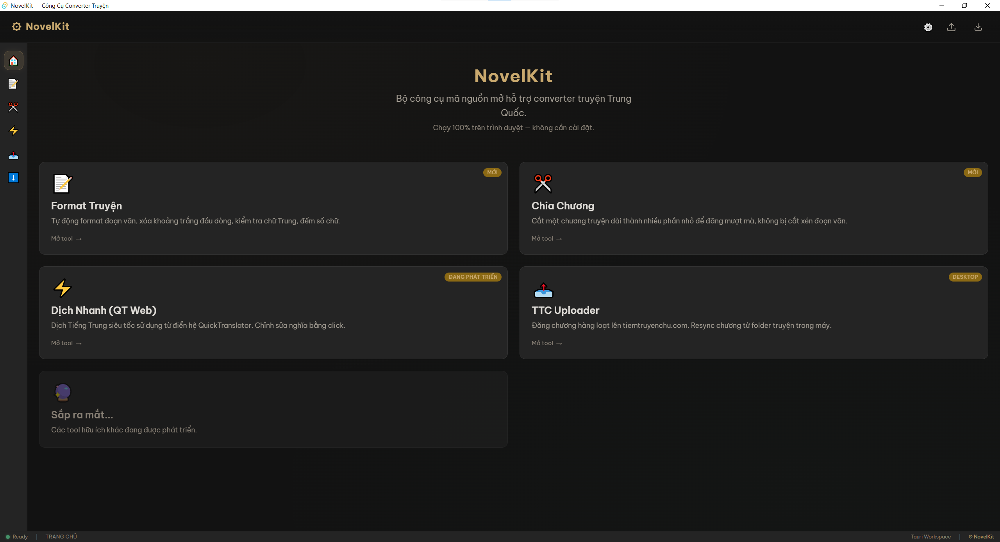
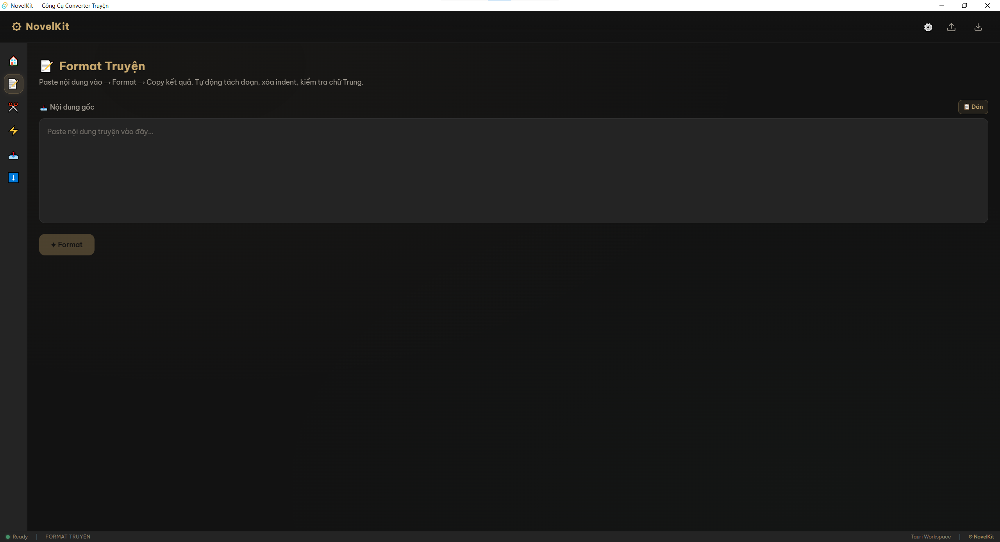
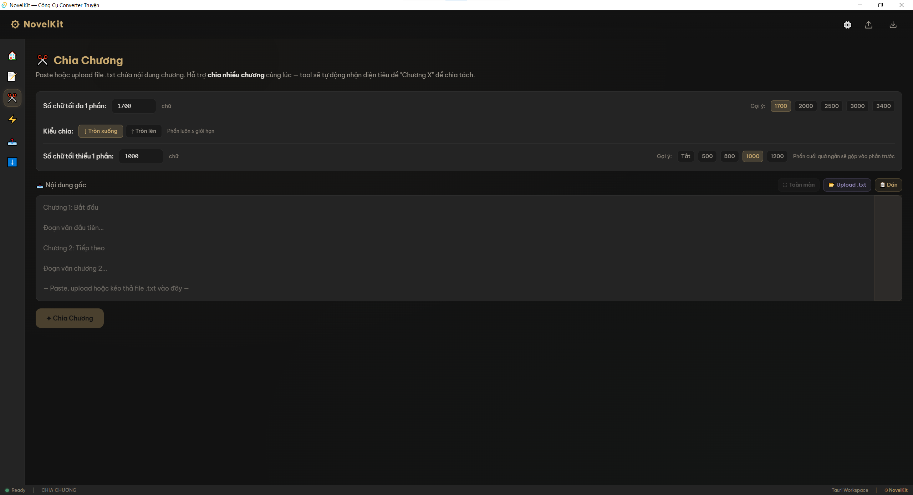
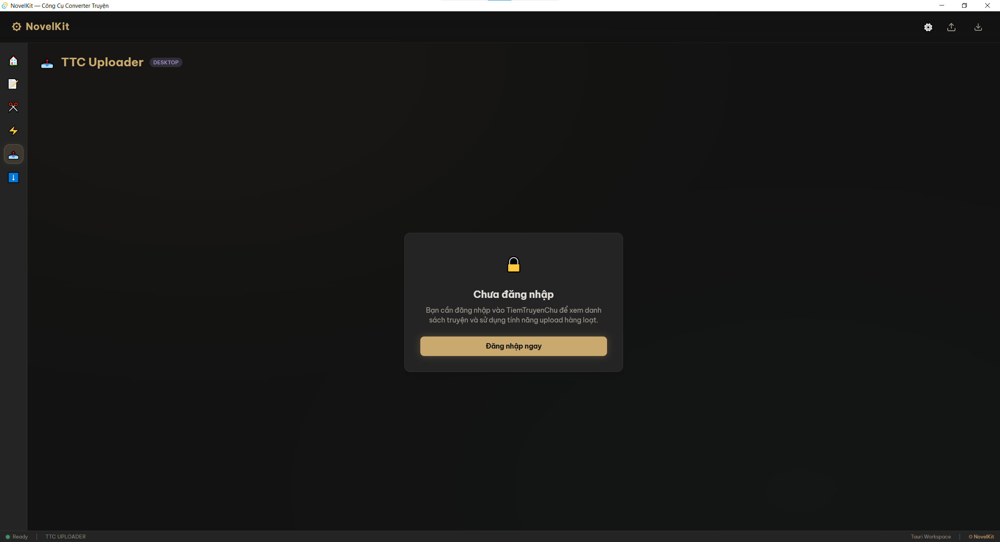
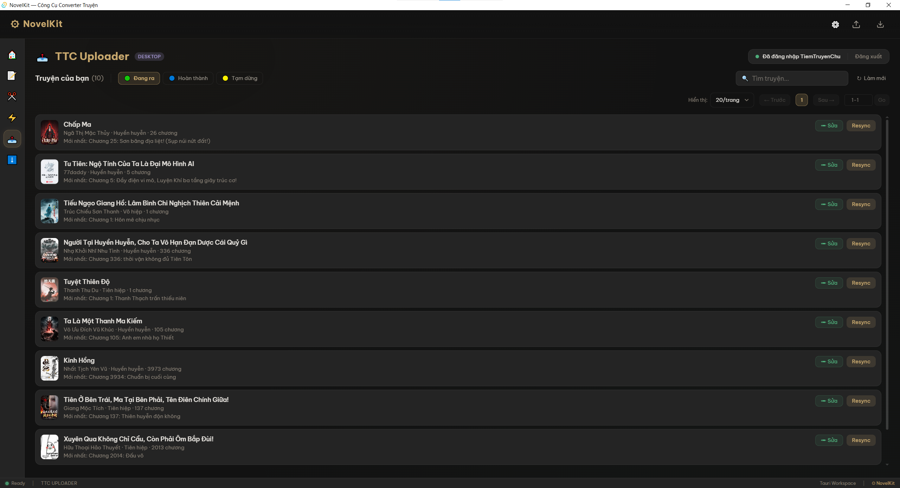
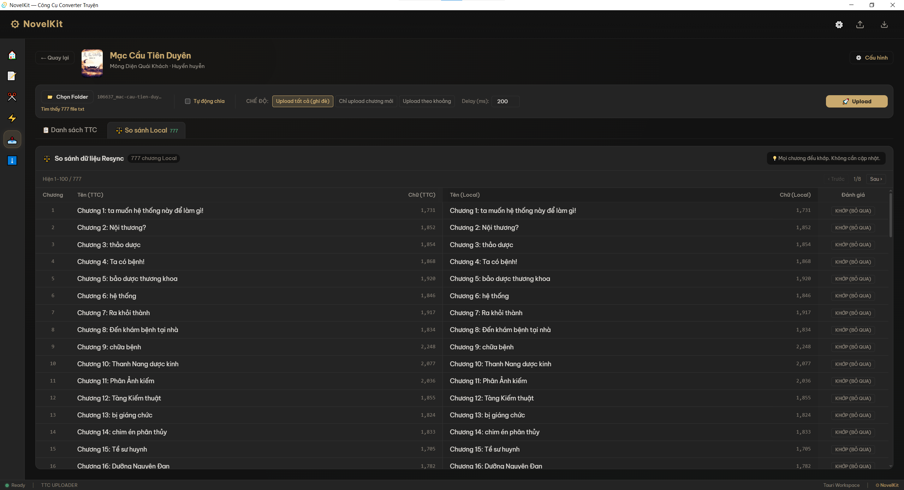

# NovelKit ⚙️

> Bộ công cụ web & desktop dành cho converter và dịch giả truyện chữ Trung Quốc.

[](LICENSE)
[](https://www.typescriptlang.org/)
[](https://react.dev/)
[](https://v2.tauri.app/)

**NovelKit** là bộ công cụ được thiết kế cho cộng đồng dịch truyện chữ Trung→Việt. Hỗ trợ cả **phiên bản web** (chạy trên trình duyệt) và **phiên bản desktop** (ứng dụng Windows qua Tauri). Toàn bộ xử lý diễn ra ngay trên thiết bị — không cần server, dữ liệu không rời khỏi máy của bạn.

> [!WARNING]  
> **Under Heavy Development / Đang phát triển tích cực**  
> Dự án hiện tại chưa có phiên bản phát hành (release) chính thức. Các tính năng và giao diện có thể thay đổi liên tục. Nếu bạn muốn sử dụng thử, vui lòng tự build ứng dụng theo hướng dẫn ở mục [Cài đặt](#cài-đặt) bên dưới.



## 📥 Tải về (Sắp ra mắt)

*Hiện chưa có file cài đặt sẵn. Khi dự án ổn định, bản cài đặt (exe/msi/portable) sẽ được cập nhật tại [GitHub Releases](https://github.com/thiendiepdt/novelkit/releases).*

| Định dạng | Mô tả |
|-----------|-------|
| `NovelKit_x.x.x_x64-setup.exe` | Bản cài đặt (NSIS) |
| `NovelKit_x.x.x_x64_en-US.msi` | Bản cài đặt (MSI) |
| `NovelKit_x.x.x_x64-portable.zip` | Bản portable — giải nén chạy luôn |

## ✨ Tính năng

### 📝 Định dạng văn bản (Text Formatter)


- Tự động format văn bản truyện: xóa thụt đầu dòng, chuẩn hóa đoạn văn
- Phát hiện chữ Hán còn sót trong bản dịch
- Thống kê ký tự và số đoạn văn

### ✂️ Chia chương (Chapter Splitter)


- Chia chương dài thành nhiều phần theo số chữ tối đa
- Chế độ nhiều chương: tự động nhận diện tiêu đề "Chương X"
- Hỗ trợ làm tròn lên/xuống khi chia
- Ngưỡng chữ tối thiểu (gộp phần cuối quá ngắn)
- Kéo thả hoặc upload file `.txt`
- Tải kết quả về dạng `.txt`

### ⚡ Dịch nhanh (Quick Translator — QT Web)
- Dịch Trung→Việt dựa trên từ điển
- Lấy cảm hứng từ phần mềm QuickTranslator (C#) kinh điển
- Thuật toán tokenize Max-Match (so khớp dài nhất)
- Hỗ trợ từ điển VietPhrase, Name và Hán Việt
- Click vào token để chỉnh sửa nghĩa dịch
- Chạy trên Web Worker — không block giao diện

### ☁️ Quản lý TiemTruyenChu (TTC Uploader) *(Desktop only)*


- Quản lý danh sách truyện và chi tiết chương trên nền tảng TiemTruyenChu.



- **Đăng chương hàng loạt**: Hàng đợi đăng truyện chạy ngầm (Background Queue), không block giao diện, kèm thông báo hệ thống.
- **Tải toàn bộ chương**: Kéo dữ liệu tất cả các chương của một truyện về máy.
- **Xử lý ảnh bìa**: Tích hợp công cụ cắt ghép (crop), xoay và chỉnh sửa ảnh bìa trực tiếp trước khi cập nhật.



- Hỗ trợ đồng bộ tiến trình và vượt qua giới hạn CORS thông qua proxy của Rust backend.

### 📥 Trình quản lý tải xuống (Download Manager) *(Desktop only)*
- Giao diện theo dõi tiến trình tải toàn bộ dữ liệu chương từ TiemTruyenChu (TTC).
- Khả năng hủy tải (cancel) an toàn giữa chừng không để lại tiến trình thừa.

### 🖥️ Ứng dụng Desktop (Tauri)
- Đóng gói thành ứng dụng Windows native qua [Tauri v2](https://v2.tauri.app/)
- Mở/lưu file trực tiếp trên máy qua native dialog
- Tự động cập nhật phiên bản mới (auto-update)
- Hiệu năng cao, dung lượng nhẹ (WebView2 + Rust backend)

## 🚀 Bắt đầu

### Yêu cầu

- [Node.js](https://nodejs.org/) ≥ 20.x
- npm ≥ 10.x
- [Rust](https://www.rust-lang.org/tools/install) ≥ 1.77 *(chỉ cần cho phiên bản desktop)*

### Cài đặt

```bash
git clone https://github.com/thiendiepdt/novelkit.git
cd novelkit
npm install
```

### Phát triển

```bash
# Chạy phiên bản web (trình duyệt)
npm run dev

# Chạy phiên bản desktop (cửa sổ Tauri + HMR)
npm run dev:desktop
```

Phiên bản web mở tại [http://localhost:1420](http://localhost:1420).

### Build production

```bash
# Build web
npm run build
npm run preview

# Build desktop (tạo installer)
npm run build:desktop
```

### Chạy test

```bash
npm run test           # Chạy toàn bộ test
npm run test:watch     # Chế độ watch
npm run test:coverage  # Kèm báo cáo coverage
```

## 🏗️ Kiến trúc

NovelKit là ứng dụng **dual-target** — cùng một frontend React chạy được trên cả trình duyệt và desktop Tauri.

```
src/                        # React frontend (dùng chung web & desktop)
├── features/               # Các module tính năng
│   ├── home/               # Trang chủ
│   ├── text-formatter/     # Công cụ định dạng văn bản
│   ├── chapter-splitter/   # Công cụ chia chương
│   └── translator/         # Dịch nhanh (QT Web)
├── shared/                 # Code dùng chung
│   ├── components/         # UI component tái sử dụng (Header, Footer, MiniMap,...)
│   ├── hooks/              # Custom hooks (useLocalStorage, useDragDrop)
│   └── utils/              # Hàm tiện ích thuần (clipboard, download, regex, platform)
└── index.css               # Design system & theme tokens

src-tauri/                  # Tauri Rust backend (chỉ dành cho desktop)
├── src/
│   ├── main.rs             # Entry point
│   └── lib.rs              # App builder, đăng ký plugin, custom commands
├── capabilities/           # Cấu hình quyền bảo mật Tauri v2
├── icons/                  # Icon ứng dụng cho các nền tảng
├── tauri.conf.json         # Cấu hình Tauri (cửa sổ, bundle, build)
└── Cargo.toml              # Dependencies Rust
```

### Quyết định thiết kế chính

- **Offline-first**: Toàn bộ xử lý diễn ra phía client. Từ điển được cache trong IndexedDB.
- **Web Workers**: Engine dịch thuật chạy ngoài main thread thông qua [Comlink](https://github.com/GoogleChromeLabs/comlink).
- **Cách ly tính năng**: Mỗi công cụ là một module độc lập trong `features/`. Không import chéo giữa các feature.
- **Dual-target**: Cùng codebase React, phiên bản web deploy lên CDN, phiên bản desktop đóng gói qua Tauri.
- **Platform detection**: Dùng `isTauri()` từ `@/shared/utils/platform` để bật/tắt tính năng desktop-only (native dialog, file system, auto-update).

### Tech Stack

| Tầng | Công nghệ | Phiên bản |
|------|-----------|-----------|
| Framework | React | 19.x |
| Build | Vite | 8.x |
| Ngôn ngữ | TypeScript | 6.x (strict mode) |
| Styling | TailwindCSS | 4.x |
| Routing | react-router-dom | 7.x |
| Worker IPC | Comlink | 4.x |
| Storage | IndexedDB (via `idb`) | 8.x |
| Desktop | Tauri | 2.x |
| Backend Desktop | Rust | 1.77+ |
| Testing | Vitest + @testing-library/react | latest |

## 🎨 Design System

NovelKit sử dụng dark theme **Warm Charcoal** với các điểm nhấn màu vàng kim, ngọc bích, tím, và đỏ thẫm — lấy cảm hứng từ phong cách Tiên Hiệp. Các design token được định nghĩa bằng CSS custom properties và tích hợp với TailwindCSS v4.

## 📖 Tài liệu

| Tài liệu | Mô tả |
|-----------|-------|
| [AGENTS.md](AGENTS.md) | Hướng dẫn dành cho AI developer — kiến trúc, quy ước, lưu ý |
| [CONTRIBUTING.md](CONTRIBUTING.md) | Hướng dẫn đóng góp |
| [docs/future_roadmap.md](docs/future_roadmap.md) | Lộ trình phát triển |
| [docs/quick_translator_tech.md](docs/quick_translator_tech.md) | Chi tiết kỹ thuật engine QT |
| [docs/text_formatter_tech.md](docs/text_formatter_tech.md) | Chi tiết kỹ thuật Text Formatter |
| [docs/chapter_splitter_tech.md](docs/chapter_splitter_tech.md) | Chi tiết kỹ thuật Chapter Splitter |

## 🤝 Đóng góp

Mọi đóng góp đều được chào đón! Vui lòng đọc [CONTRIBUTING.md](CONTRIBUTING.md) để biết hướng dẫn chi tiết.

## 📄 Giấy phép

Dự án được phát hành theo giấy phép [GPLv3](LICENSE) — **General Public License v3**.

Bạn được tự do sử dụng, chỉnh sửa và phân phối mã nguồn, nhưng bất kỳ phần mềm nào sử dụng hoặc chỉnh sửa mã nguồn này cũng phải được phát hành dưới cùng giấy phép GPLv3 (kèm theo mã nguồn).

---

<p align="center">
  Được xây dựng với ❤️ cho cộng đồng dịch truyện chữ Trung Quốc.
</p>
